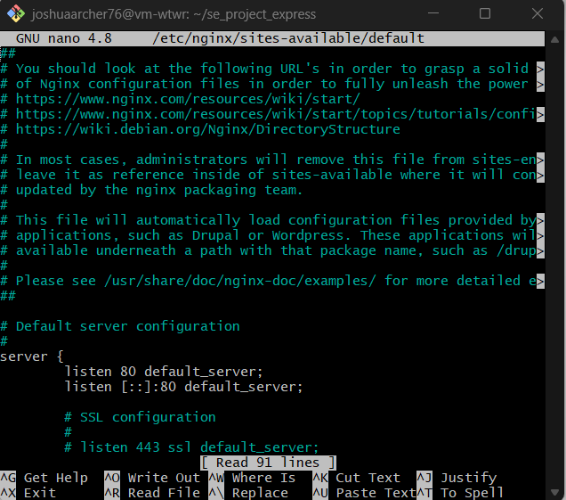

# WTWR (What to Wear?): Back End

The back-end project is focused on creating a server for the WTWR application. You’ll gain a deeper understanding of how to work with databases, set up security and testing, and deploy web applications on a remote machine. The eventual goal is to create a server with an API and user authorization.

## Description of the project and it's functionality as well as the technologies and techniques used:

This project is meant for the purpose of learning back-end code, so you can get hands on expierence with setting up rest api's, handling errors, setting up controllers, models, routes and connecting my project to a live server using mongoose. In this project I was able to apply my newly gained knowledge to further my development as an aspiring full-stack developer, with the use of .eslintrc.js and package.json, I was able to create customized rules and devDependencies, in order to achieve specific criteria required by TripleTen, following the best practices of implementation for errors, controllers, models, routes and rest api's, per ES6 as well as when and when not to use SQL and NoSQL.

## This project contains:

Generalized global error handling as a fail safe, as to when errors that might not be named come along to crash the party.
Variablized error status codes, so there aren't random numbers (who knows what they mean?) that are passed into the code.
Use of the .orFail() method that allows you to throw custom errors in case those pesky errors don't want to be caught(evil laugh).
NoSQL, because who wants "just" SQL.
ClothingItem controller that allows you to create an item, get an item or items, delete an item, destroy an item! (just kidding), like an item, and unlike an item.
User controller, has all the same qualities of clothingItem controller without all the harmful delete functions(NOT YET ANYHOW!).
Models for each controller (kind of like a parental figure, so they know how to behave).
An index.js because your not really an application without one. This is where everything comes together just to hang out for a bit.
Utils folder, which contains {
A .gitIgnore file, because we don't want Git to know about everything do we?
A .eslintrc.js which is a configuaration file for a tool name ESLINT, it is used for identifying and reporting on patterns found in ECMAScript/JavaScript code(The gossiper of the community).
}
An app.js, telling the application what it needs to do and when to do it(kind of like a my wife..).

(pretty much instagram)

## Running the Project:

`npm run start` — to launch the server

`npm run dev` — to launch the server with the hot reload feature

### Testing:

Before committing your code, make sure you edit the file `sprint.txt` in the root folder. The file `sprint.txt` should contain the number of the sprint you're currently working on. For ex. 12

## File location for nginx:

## Domian name:

wtwr.surfnet.ca
